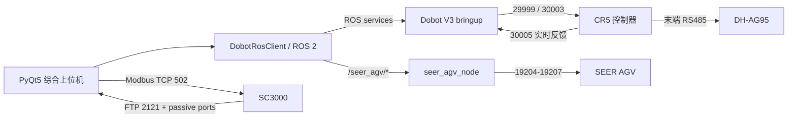

# 基于越疆-仙工复合机器人开发的综合上位机

面向 Ubuntu 22.04 / ROS 2 Humble 的一体化机器人工作空间。项目将 Dobot CR5、
末端 DH-AG95 电动夹爪、海康 SC3000 智能相机、AprilTag 2.5D 定位和 SEER AGV
集成到同一个 PyQt5 上位机，并在 ROS 2 层隔离各设备的通信与安全状态。

> 本项目不是经过认证的安全控制系统。调试真机时必须保留实体急停、现场监护和
> 设备原生安全功能。任何软件状态都不能替代对现场、负载、工具和运动路径的确认。

## 功能概览

- 检查 CR5 TCP 和 ROS 2 驱动状态，显示模式、六轴角度与 Tool0 位姿；
- 使能/下使能、报警读取与清除、人工确认后恢复模式 10；
- 安全进入拖动模式，取点并原子保存关节角、末端位姿和 SC3000 图像；
- 低速关节点运动，不使用会阻塞官方驱动的 `Sync()`；
- 控制末端 RS485 上的 DH-AG95，包括初始化、夹持力、开度和反馈；
- 串行执行“AGV航点导航—点位运动—夹爪—等待”任务队列；
- 在任务队列中测量固定 AprilTag 的 6D 到站偏差，并将同一纠偏量应用到接近、
  按压和撤回等多个 Tool0 笛卡尔点位；
- 以 FTP + Modbus TCP 获取 SC3000 图像，目标预览速率 5 FPS；
- 棋盘格内参标定、AprilTag `solvePnP`、眼在手上手眼标定；
- 实时输出 AprilTag 的相机坐标和 CR5 User0/基座坐标；
- 显示地图、站点、车体位置，支持加载地图、重定位、定位确认、站点导航
  和低速点动。

## 系统结构



只有 `seer_agv_node` 可以持有 AGV TCP 连接；GUI 只使用 ROS 2 话题和服务。
CR5 服务使用 `/dobot_bringup_v3/*`，AGV 使用 `/seer_agv/*`，两套接口互不覆盖。

## 快速开始

```bash
export DOBOT_WS="${HOME}/dobot_ws"
cd "${DOBOT_WS}"

unset PYTHONHOME PYTHONPATH
source /opt/ros/humble/setup.bash
colcon build --symlink-install
source install/setup.bash
```

启动 CR5 驱动：

```bash
export DOBOT_TYPE=cr5
export IP_address=192.168.192.201
export DOBOT_FEEDBACK_PORT=30005
ros2 launch dobot_bringup_v3 dobot_bringup_ros2.launch.py
```

另开终端启动综合上位机：

```bash
export DOBOT_WS="${HOME}/dobot_ws"
"${DOBOT_WS}/start_dobot_operator_gui.sh"
```

启动脚本不会自动使能机械臂或发送非零 AGV 速度。AGV 驱动只会在有线载波、
路由和状态端口均通过检查后启动。

## 文档导航

1. [硬件、网络和安全](docs/01-hardware-network-safety.md)
2. [安装、构建和启动](docs/02-install-build-run.md)
3. [CR5 驱动、拖动取点与点位运动](docs/03-cr5-operation.md)
4. [SC3000、AprilTag 与标定](docs/04-sc3000-vision-calibration.md)
5. [DH-AG95 夹爪与任务队列](docs/05-dh-ag95-and-queue.md)
6. [SEER AGV 地图、定位、导航与点动](docs/06-seer-agv.md)
7. [ROS 2 与设备 API 参考](docs/07-api-reference.md)
8. [代码目录、修改记录与扩展方法](docs/08-code-inventory-development.md)
9. [测试、验收与故障排查](docs/09-testing-troubleshooting.md)
10. [从首次联调到综合上位机的开发记录](docs/10-project-history.md)
11. [GitHub 发布、许可证与复用交接](docs/11-github-release-reuse.md)
12. [源码、接口与测试文件清单](docs/12-source-manifest.md)

参与开发前请阅读 [CONTRIBUTING.md](CONTRIBUTING.md)。

## 仓库布局

```text
dobot_ws/
├── src/
│   ├── DOBOT_6Axis_ROS2_V3/   # 设备方 ROS 2 V3 驱动及本项目修复
│   ├── dobot_point_manager/    # 安全点位运动 CLI
│   ├── dobot_operator_gui/     # 综合上位机、视觉与标定工具
│   ├── seer_agv_driver/        # SEER TCP API 的唯一 ROS 所有者
│   └── seer_agv_msgs/          # AGV 自定义服务
├── points/                     # 点位/标定数据，生产部署时自行管理
├── queues/                     # GUI 保存的任务队列
├── estimate_apriltag_pose.sh   # AprilTag 单帧定位快捷入口
└── start_dobot_operator_gui.sh # 综合启动器
```

`build/`、`install/`、`log/` 是 colcon 产物，不应提交到 GitHub。

## 验证基线

- Ubuntu 22.04、ROS 2 Humble、系统 Python 3.10；
- Dobot CR5 + V3 TCP-IP 服务；
- DH-AG95，末端 RS485，Modbus RTU 从站 1，115200 8N1；
- SC3000，1408×1024，FTP + Modbus TCP；
- AprilTag `tag36h11`，现场黑框边长 58.5 mm；
- SEER Robokit 3.4.4.6；
- 驱动恢复、协议、视觉纠偏、GUI 和安全状态机功能测试共 152 项通过
  （2026-08-12，系统 ROS/Python 环境）。

现场 IP、相机内参、手眼外参、末端负载和地图名称都是部署数据，不是跨设备通用
参数。复制本仓库后必须重新确认或重新标定。
